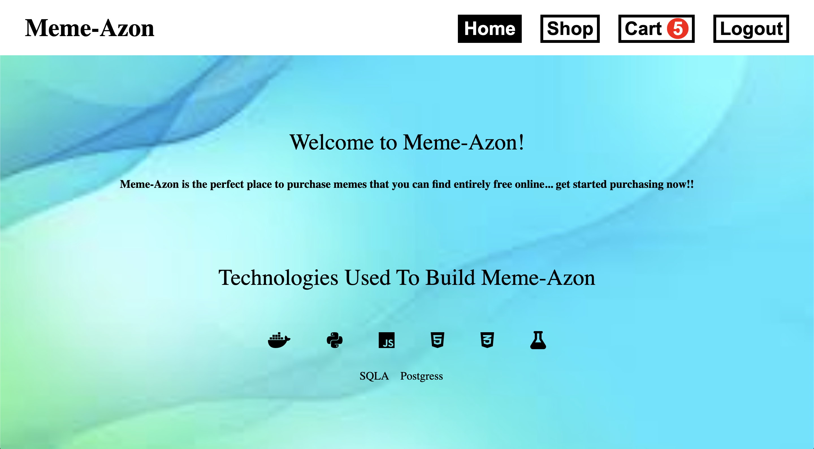

# Welcome to MemeAzon!

### **Live Link: [MemeAzon](https://memeazon.herokuapp.com/shop)**

_meme-azon_, modeled after the e-commerce giant [Amazon](https://amazon.com/), is a lite e-commerce platform; allowing users to purchase the spiciest memes around.

### Home and About View


<!-- ADD CHANNELS VIEW HERE -->

## Prerequisites

Before you begin, please check the following Wiki documents:
* [MVP Feature List](https://github.com/nathanieldcooke/meme-azon/wiki/MVP-Feature-List)
List of features needed for the minimum viable product(MVP).

* [Database Schema](https://github.com/nathanieldcooke/meme-azon/wiki/Database-Schema)
SQLAlchemy Database Schema.

* [API Routes](https://github.com/nathanieldcooke/meme-azon/wiki/API-Routes)
API routes will be used by the frontend for accessing the database from the backend and dynamically update the page. 

* [Frontend Routes](https://github.com/rsdimatulac/SlackX/wiki/Frontend-Routes)
Routes that return a page that the user can interact with.

* [Wire Frames](https://github.com/nathanieldcooke/meme-azon/wiki/Wire-Frames)
Wire frames relative to frontend routes.

## Technologies used:
#### Backend
* Python
* Flask
* SQLAlchemy
* PostgreSQL
* Docker
* `wtforms`, `wtforms validators`
* `faker` for seed data

#### Frontend
* React.js
* Redux
* JavaScript
* HTML, Vanilla CSS
* Heroku (for hosting services)

### Code Highlights / Challenges

#### Highlights 

* creating a useEffect to auto-fill the demo forms

`react-app/src/components/auth/Demo...`
```js
useEffect(() => {
        const updateFunc = async () => {
            await sleep(50)
            if (emailArr.length) {
                setEmail(email => email + emailArr[0])
                setEmailArr(emailArr.slice(1, emailArr.length))
            } else if (firstnameArr.length) {
                setFirstname(firstname => firstname + firstnameArr[0])
                setFirstnameArr(firstnameArr.slice(1, firstnameArr.length))
            } else if (lastnameArr.length) {
                setLastname(lastname => lastname + lastnameArr[0])
                setLastnameArr(lastnameArr.slice(1, lastnameArr.length))
            } else if (passwordArr.length) {
                setPassword(password => password + passwordArr[0])
                setPasswordArr(passwordArr.slice(1, passwordArr.length))
            } else if (confirmPasswordArr.length) {
                setConfirmPassword(confirmPassword => confirmPassword + confirmPasswordArr[0])
                setConfirmPasswordArr(confirmPasswordArr.slice(1, confirmPasswordArr.length))
            } else {
                onSignUp()
            }
        }
        updateFunc()
    }, [emailArr, firstnameArr, lastnameArr, passwordArr, confirmPasswordArr]);
```

#### Challenges
* One of the team's biggest challenges was implementing `socket.io` in our application for the Live Chat feature. Having zero knowledge of the concept motivated us to find useful documentation and use resources at our disposal. After researching and seeking guidance from our advisors, we succesfully implemented a websocket that listens to a `chat` event which then broadcasts the messages to the channel it was sent to. This resulted to a fully functioning Live Chat which is the main feature of SlackX.

* Populating the subscriptions table with seed data was an initial challenge. After parsing through the documentation, we determined that the model relationships would work in tandem with `append()` to populate the subscriptions table with seed data. After generating the User and Channel tables data, the solution was as simple as implementing a nested `for...in loop` to populate the aforementioned subscriptions table seed data. Refer to the code snippet above.

## Future Implementations 
- Stripe payment processing
- Orders table to db

## MemeAzon Developer
- [@nathanieldcooke](https://github.com/nathanieldcooke)
---
_© 2021 MemeAmazon. No rights reserved._

Credit for Favicon: 

favcon credit link: <a target="_blank" href="https://icons8.com/icon/66745/circled-m">Circled M</a> icon by <a target="_blank" href="https://icons8.com">Icons8</a>
